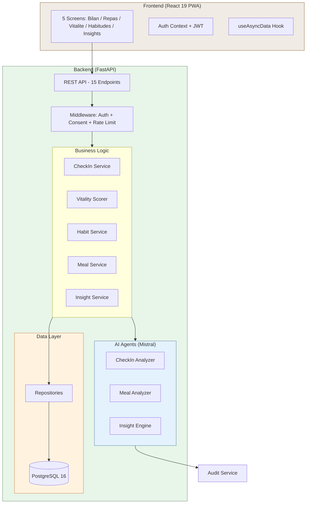
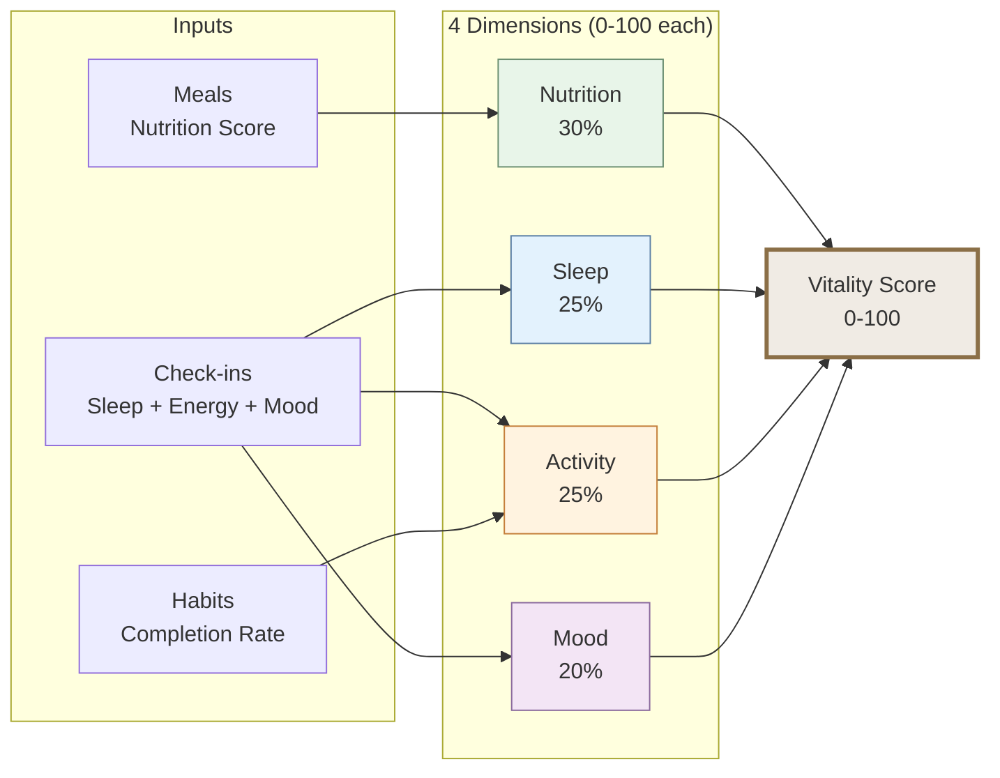

# VitalAge

[](https://github.com/soneeee22000/vitalage)
[](https://www.python.org/)
[](https://www.typescriptlang.org/)
[](https://fastapi.tiangolo.com/)
[](https://react.dev/)
[](LICENSE)
[](https://vitalage-102991984200.europe-west1.run.app)

> **60 seconds a day. Your body's user manual, written by your own data.**

VitalAge is a daily vitality companion for smart aging. 60-second morning check-ins build into a personal health equation — a Vitality Score that tracks nutrition, sleep, activity, and mood over time. Built for the **Nestle Vital VivaTech 2026** challenge on Smart Aging.

**[Live Demo](https://vitalage-102991984200.europe-west1.run.app)** | **[API Docs](https://vitalage-102991984200.europe-west1.run.app/docs)**

---

## The Problem

The average health app is abandoned in 7 days. 80% have under 6% retention at day 30. The reason: **no feedback loop**. You log food — nothing happens. You track mood — nothing changes.

Meanwhile, France has 14M+ adults over 60 (growing to 20M by 2030), and no accessible digital health companion serves this demographic without requiring expensive hardware.

## The Solution

VitalAge closes the feedback loop with 5 integrated features:

| Feature           | What it does                                | How it feels                         |
| ----------------- | ------------------------------------------- | ------------------------------------ |
| Morning Check-in  | Sleep, energy, mood, symptoms in 60 seconds | Like brushing teeth                  |
| Vitality Score    | 0-100 composite across 4 dimensions         | Like a credit score for health       |
| Micro-Habits      | 3 active habits with Duolingo-style streaks | Like a daily game                    |
| Meal Analysis     | AI nutritional assessment from meal photos  | Like a friendly nutritionist         |
| Personal Insights | AI-detected correlations from YOUR data     | Like reading your body's user manual |

---

## Architecture



## Vitality Score Algorithm



## Tech Stack

| Layer        | Technology                                       | Why                                   |
| ------------ | ------------------------------------------------ | ------------------------------------- |
| **Frontend** | React 19, TypeScript (strict), Tailwind CSS, PWA | Installable, mobile-first, accessible |
| **Backend**  | Python 3.12, FastAPI, SQLAlchemy async, Alembic  | Async AI calls, type-safe, proven     |
| **Database** | PostgreSQL 16 (Cloud SQL)                        | JSONB for FHIR, reliable              |
| **AI**       | Mistral Small + Mistral Vision                   | European AI, EU data residency        |
| **Auth**     | JWT (python-jose) + bcrypt                       | Stateless, secure                     |
| **Infra**    | Docker, Google Cloud Run, GitHub Actions         | Auto-scaling, CI/CD                   |
| **Testing**  | pytest (34 tests), vitest (30 tests)             | 64 total, all passing                 |

## Features

### Morning Check-in (60 seconds)

- Sleep quality (1-5), energy (1-5), mood (5 options), optional symptoms
- AI structures free-text symptoms into categories
- Triggers automatic vitality score recalculation
- Streak tracking with celebration animations

### Vitality Score Dashboard

- Animated circular score (0-100) with color coding
- 4 color-coded dimension bars (green/blue/orange/purple)
- Weekly trend sparkline with SVG chart
- Change indicator vs last week

### Micro-Habits (Duolingo-style)

- 12 evidence-based templates across 4 dimensions
- Max 3 active habits with streak tracking
- Tap-to-complete with satisfying animations
- Template browser grouped by dimension

### Meal Photo Analysis

- Camera capture with meal type selector
- Mistral Vision AI nutritional assessment
- Positive framing (never calories, always quality)
- Foods identified, highlights, micro-tip

### Personal AI Insights

- Correlation detection from 7+ days of data
- "When you sleep >4/5, your energy is 40% higher"
- Locked state until enough data collected
- Strength badges (Fort / Modere / Faible)

## API Overview

| Method | Endpoint                                 | Purpose                 |
| ------ | ---------------------------------------- | ----------------------- |
| `POST` | `/api/v1/auth/register`                  | Create account          |
| `POST` | `/api/v1/auth/login`                     | Get JWT tokens          |
| `POST` | `/api/v1/auth/refresh`                   | Refresh token           |
| `POST` | `/api/v1/check-ins`                      | Submit daily check-in   |
| `GET`  | `/api/v1/check-ins/patients/{id}/status` | Today's status + streak |
| `GET`  | `/api/v1/check-ins/patients/{id}`        | Check-in history        |
| `POST` | `/api/v1/meals/analyze`                  | Meal photo analysis     |
| `GET`  | `/api/v1/meals/patients/{id}`            | Meal history            |
| `GET`  | `/api/v1/vitality/patients/{id}`         | Vitality score          |
| `GET`  | `/api/v1/vitality/patients/{id}/trends`  | Score trends            |
| `POST` | `/api/v1/habits/activate`                | Start a habit           |
| `POST` | `/api/v1/habits/{id}/complete`           | Complete habit          |
| `GET`  | `/api/v1/habits/patients/{id}`           | Active habits + streaks |
| `GET`  | `/api/v1/habits/templates`               | Available templates     |
| `GET`  | `/api/v1/insights/patients/{id}`         | Personal insights       |

## Design System

Built for the **45-70 demographic** with accessibility-first principles:

- **Colors**: Warm earth tones with vitality green (`#6b8f71`)
- **Typography**: Lora (headings) + Inter (body), 18px minimum
- **Touch targets**: 44px+ minimum (most are 56px)
- **Contrast**: 4.5:1+ ratio on all interactive elements
- **Language**: French throughout
- **Dimension colors**: Nutrition (green), Sleep (blue), Activity (orange), Mood (purple)

## Getting Started

### Prerequisites

- Python 3.10+
- Node.js 22+
- PostgreSQL 16 (or Docker)

### Local Development

```bash
# Start PostgreSQL
docker compose up db -d

# Backend
cd backend
cp .env.example .env    # Edit with your Mistral API key
pip install -r requirements.txt
uvicorn src.main:app --reload

# Frontend (separate terminal)
cd frontend
npm install --legacy-peer-deps
npm run dev
```

Open http://localhost:5173

### Run Tests

```bash
# Backend (34 tests)
cd backend && python -m pytest tests/ -v

# Frontend (30 tests)
cd frontend && npm run test
```

### Deploy to Cloud Run

```bash
gcloud run deploy vitalage \
  --source=. \
  --region=europe-west1 \
  --allow-unauthenticated \
  --set-env-vars="APP_ENV=production,MISTRAL_API_KEY=your-key"
```

## Behavior Change Science

VitalAge implements 5 peer-reviewed frameworks:

| Framework                     | Implementation                                                                     |
| ----------------------------- | ---------------------------------------------------------------------------------- |
| **BJ Fogg Tiny Habits**       | 60-second check-in anchored to morning routine                                     |
| **Nir Eyal Hook Model**       | Trigger (notification) -> Action (check-in) -> Reward (score) -> Investment (data) |
| **Self-Determination Theory** | Autonomy (choose habits), Competence (score improves), Relatedness (share)         |
| **Implementation Intentions** | Onboarding asks "When will you check in?"                                          |
| **JITAI**                     | Right nudge at right moment based on YOUR patterns                                 |

## Project Structure

```
vitalage/
  backend/
    src/
      agents/          # AI agents (Mistral)
      api/v1/          # FastAPI routes
      config/          # Settings
      db/              # Models + repositories
      middleware/       # Auth, consent, rate limit
      models/          # Pydantic schemas + FHIR
      services/        # Business logic
    tests/             # 34 pytest tests
    scripts/           # Demo data seeder
  frontend/
    src/
      components/      # UI components (Button, Card, Nav...)
      lib/             # API client, auth, hooks
      pages/           # 7 pages (CheckIn, Vitality, Habits...)
      test/            # 30 vitest tests
  docs/
    PRD.md             # Product requirements
  Dockerfile           # Multi-stage build
  docker-compose.yml   # Local dev
```

## About

Built by **Pyae Sone Kyaw (Seon)** for the Nestle Vital VivaTech 2026 challenge.

- Full-Stack AI Engineer based in Paris
- Dual Master's: Telecom SudParis + Asian Institute of Technology
- Former Founding AI Engineer at Siloett.AI (Station F)

## License

MIT License. See [LICENSE](LICENSE) for details.
